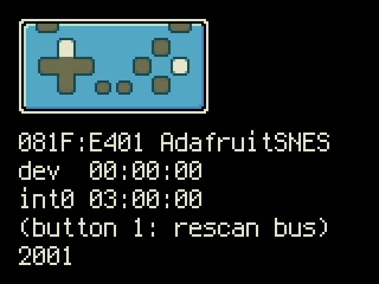

<!-- SPDX-License-Identifier: MIT -->
<!-- SPDX-FileCopyrightText: Copyright 2025 Sam Blenny -->
# Fruit Jam Gamepad Tester

This an updated version of my old gamepad tester. The new one is for Fruit Jam.

Link for the new guide:
- [Fruit Jam Gamepad Tester](https://adafruit-playground.com/u/SamBlenny/pages/fruit-jam-gamepad-tester)

Links for the old ESP32-S3 Feather TFT gamepad tester:
- code: [feather-tft-gamepad](https://github.com/samblenny/feather-tft-gamepad)
- guide: [Feather TFT Gamepad Tester with Sprites](https://adafruit-playground.com/u/samblenny/pages/feather-tft-gamepad-tester-with-sprites)

**CAUTION:** This code was developed and tested on a pre-release revision B
Fruit Jam prototype board using CircuitPython 10.0.0-alpha builds from the
circuitpython.org
[Fruit Jam downloads](https://circuitpython.org/board/adafruit_fruit_jam/) page.
As I write this, USB support for Fruit Jam is under active development. Things
may change by the time CircuitPython 10.0.0 is released.
